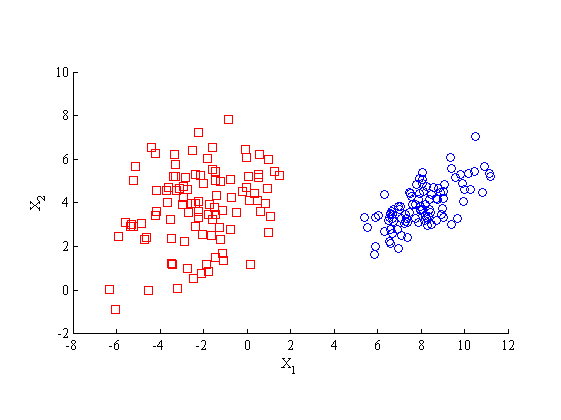
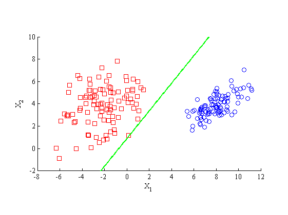
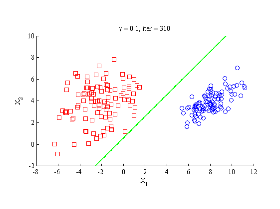
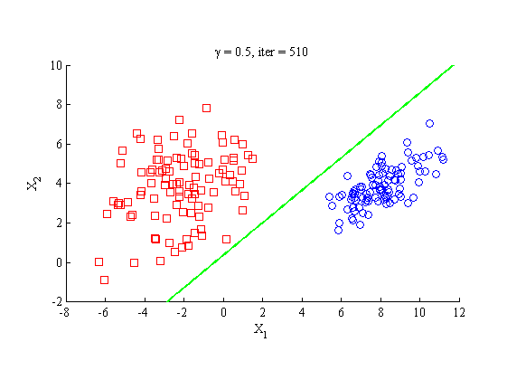
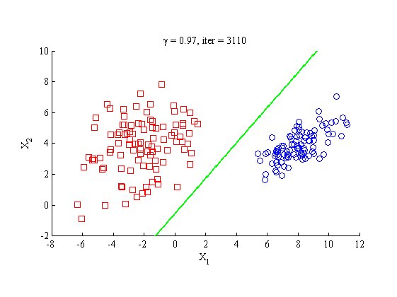

# Classical and Margin Perceptron
## Problem Description
The training process of the classical perceptron (Algorithm 1) can be regarded as a searching process for a solution in feasible solution region, whereas no strict restrictions are demanded for the capacity of this solution. The solution only needs to satisfy $\alpha^Ty_n>0$, where $\alpha$ is the weight vector of the perceptron, and $y_n$ is the normalized augmented sample vector. However, the margin perceptron (Algorithm~\ref{alg:2}) requires the finally converged hyperplane possesses a margin ($>\gamma$), where $\gamma$ is a predifined positive scalar. It means that the final solution of perceptron need to satisfy   $\alpha^Ty_n>\gamma$.

Thus, there are two types of ```mistakes``` during the traing of perceptron, namely (1) the prediction mistake and (2) margin mistake (i.e., its prediction is correct but its margin is not large enough).


1.Algorithm 1

  |Fixed-Increment Single Sample Correction Algorithm|
  |:---|
  |1. **initialize** $\alpha$,$k \gets 0$|
  |2. **repeat**|
  |3. &emsp;$k \gets (k+1)$ $mod$ $n$|
  |4.  &emsp;**if** $y_k$ is misclassified by $\alpha$ **then**|
  |5. &emsp;&emsp; $\alpha \gets \alpha + y_k$|
  |6.  &emsp;**endif**|
  |7. **until** all patterns are properly classified|
  |8. **return** $\alpha$|

2.Algorithm 2
|Single Sample Correction Algorithm With Margin|
  |:---|
  |1. **initialize** $\alpha,k \gets 0,~\gamma > 0$|
  |2. **repeat**|
  |3. &emsp;$k \gets (k+1)$ $mod$ $n$|
  |4.  &emsp;**if** $\alpha^Ty_k\leq\gamma$ **then**|
  |5. &emsp;&emsp; $\alpha \gets \alpha + y_k$|
  |6.  &emsp;**endif**|
  |7. **until** all patterns are properly classified with a large enough margin $\gamma$|
  |8. **return** $\alpha$|

1. Please generate 200 datapoints in the 2D plane, among which 100 datapoints are labeled as 1 and the remaining 100 are labeled as -1. Make sure that these 200 datapoints are linearly separable. Plot these 200 datapoints in a 2D plane;

2. Implement the classical perceptron algorithm and run it on the above generated datapoints. Plot the classification boundary and these datapoints in one figure;

3. Implement the margin perceptron algorithm and run it on the above generated datapoints. Plot the classification boundary and these datapoints in one figure. Analyse the impacts of $\gamma$ on algorithm convergence and the classification boundary.

## Result
### Random Initialization

### Classical Perceptron

### Margin Perceptron
#### $\gamma = 0.1$

#### $\gamma = 0.5$

#### $\gamma = 0.8$

#### $\gamma = 0.97$
