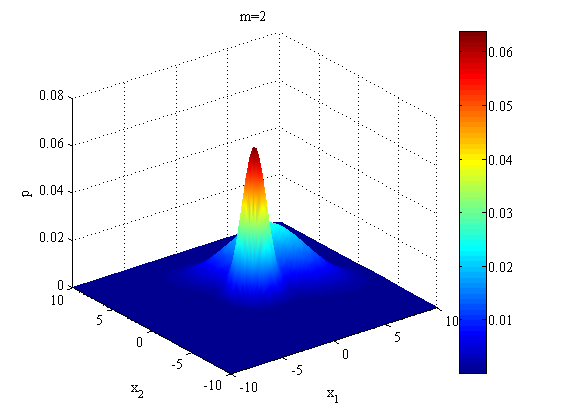
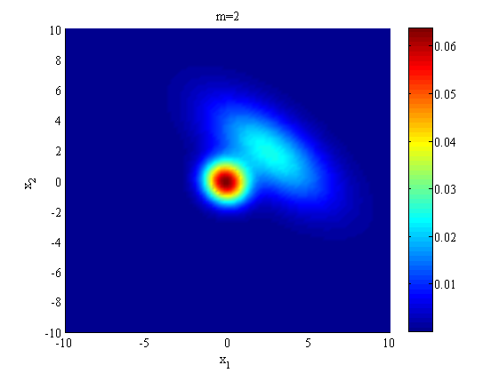
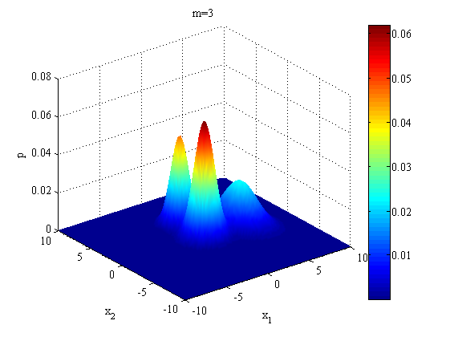
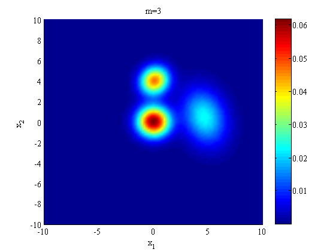
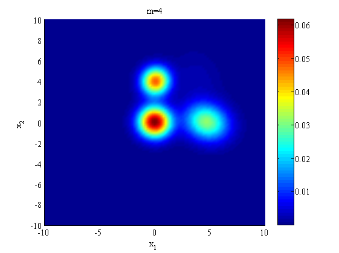
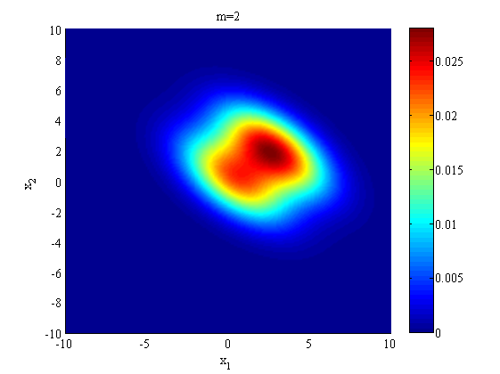
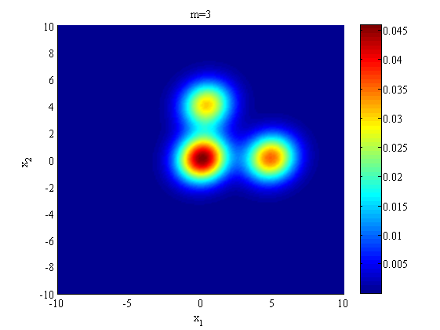
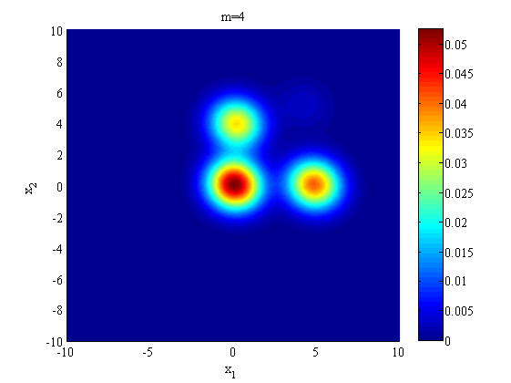
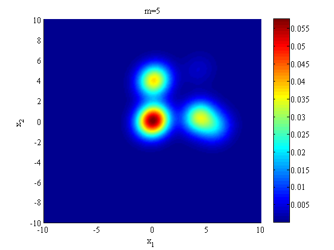

# EM (Expectation Maximization)
## Problem Description

Consider the case that the hidden variable $y \in \{1, ..., m\}$ is discrete while the visible variable $x \in R^d$ is continuous. 
In other words, we consider mixture models of the form

$$p(x) = \sum_{j = 1}^m p(x|y = j)p(y=j).$$

We assume throughout that $x$ is conditionally Gaussian in the sense that $x \sim \mathcal{N}(\mu_j, \Sigma_j)$ when $y = j$.

The file **emdata.mat** contains visible variable $x$.
Please implement EM algorithm manually, and:
1. Run EM algorithm on this data with $m=2,3,4,5$ and visualize results.
2. Modify the M-step such that the covariance matrices of different Gaussian components are equal. Give derivation and rerun the code with $m=2,3,4,5$ and provide visualizations.

In this assignment, you are **NOT** allowed to use any existing libraries or code snippets that provides EM algorithm (e.g., **scikit**/**OpenCV** in python or **emgm** in Matlab).

## Results for Q1
### m = 2

### m = 3

### m = 4

### m = 5

## Result for Q2
### m = 2

### m = 3

### m = 4

### m = 5

