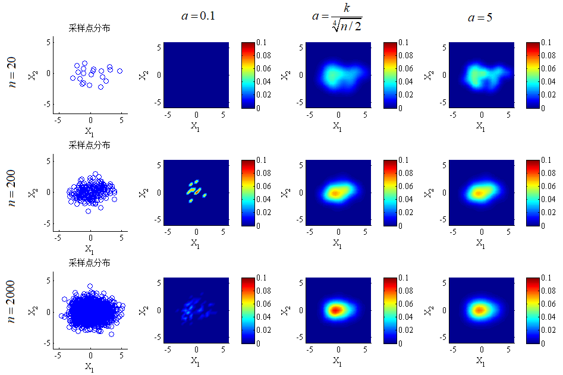

# Error Rate Estimation
## Problem Description

Consider a two dimensional classification problems: $p(\omega_{1})=p(\omega_{2})= 0.5$, $p(x|\omega_{1}) \sim N(\mu_{1},\sigma_{1}),p(x|\omega_{2}) \sim N(\mu_{2},\sigma_{2})$, where $\mu_{1} = (-1,0),\mu_{2} = (1,0),\sigma_{1} = \begin{pmatrix}
1&0\\
0&1
\end{pmatrix},\sigma_{2} = \begin{pmatrix}
2&0\\
0&1
\end{pmatrix}$

1. Find the misclassification rate of Bayesian classifier numerically.

2. Draw $n$ samples from $p(x|\omega_{1})$ and $p(x|\omega_{2})$ with labels respectively. Estimate $p_{n}(x|\omega_{1})$ and $p_{n}(x|\omega_{2})$ by Parzen window method, with Gaussian window function and unit hypercube window function. Design Bayesian classifier with your estimated $p_{n}(x|\omega_{1})$ and $p_{n}(x|\omega_{2})$. Compare their misclassification rate with the theoretical optimal Bayesian classifier in theory.

3. From above experiments, what's your suggestion for choosing optimal window function and parameters with given $n$?

4. Sample $2n$ points from the mixture Gaussian distribution p(x) without labels. Use EM to estimate$\mu_{1},\mu_{2},\sigma_{1},\sigma_{2}$ so that we estimate $p_{2n}(x|\omega_{1})$ and $p_{2n}(x|\omega_{2})$. Which method is more accurate in estimating $p(x|\omega_{1})$ and $p(x|\omega_{2})$, EM or Parzen window? Prove your statement by experiments.

5. Design Bayesian classifier with the estimated $p_{2n}(x|\omega_{1})$ and $p_{2n}(x|\omega_{2})$ by EM. Analyze its performance, i.e., the expectation and variance of misclassification rate and compare them with that of optimal Bayesian classifier.

6. Conclude your results. Which method is your favorite to estimate parameters and which classifier is your favorite classifier? Why?

## Result
### Square Parzen Window

### Norm Parzen Window

### EM
