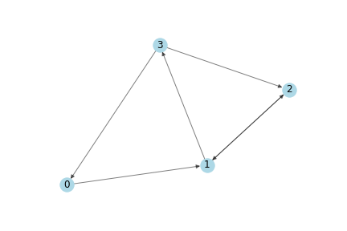

# GNN (Graph Neural Network)
## Problem Description

One of the simplest possible propagation rule in GCN:
$$f(H^i, A) = \sigma(A H^i W^i)$$
where $W^i$ is the weight matrix for layer $i$ and $\sigma$ is a non-linear activation function such as the ReLU function. The weight matrix has dimensions $F^i \times F^{i+1}$; in other words the size of the second dimension of the weight matrix determines the number of features at the next layer. If you are familiar with convolutional neural networks, this operation is similar to a filtering operation since these weights are shared across nodes in the graph.

Simplifications: Let’s examine the propagation rule at its most simple level. Let
1. $i = 1$, s.t. $f$ is a function of the input feature matrix,
2. $\sigma$ be the identity function, and
3. choose the weights s.t. $AH^0W^0 = AXW^0 = AX$

In other words, $f(X, A) = AX$. This propagation rule is perhaps a bit too simple, but we will add in the missing parts later. As a side note, $AX$ is now equivalent to the input layer of a multi-layer perceptron.

We'll use the following graph:


(a) Derive the adjacency matrix representation $A$ and degree matrix $D$. Note that in this case a node n is a neighbor of node v if there exists an edge from v to n.

(b) We generate features for every node based on its index, i.e. $[i, -i]$ for node $i$.  Apply the propagation rule on adjacency matrix $A$ and input features $X$ to derive the output matrix.

(c) We found that nodes with large degrees will have large values in their feature representation while nodes with small degrees will have small values. This can cause vanishing or exploding gradients. Therefore, the feature representations can be normalized by node degree by transforming the adjacency matrix $A$ by multiplying it with the inverse degree matrix $D$. Thus our simplified propagation rule looks like this: $f(x,A) = D^{-1}AX$. We also found that the aggregated representation of a node does not include its own features. To address the problem, we add a self-loop to each node, by adding the identity matrix $I$ to the adjacency matrix $A$ before applying the propagation rule, that is, $\hat{A} = A + I$. $\hat{D}$ is the degree matrix of $\hat{A}$, i.e., the degree matrix of A with forced self-loops. Derive the output matrix after normalizing the Feature Representations and adding Self-Loops.

(d) We add back the weights matrix $W$ as follows. Derive the output matrix.
$$
    W =\begin{bmatrix} 1 & -1 \\ -1 & 1 \end{bmatrix}
$$

(e) Use the same $W$ and add the ReLU activation function for $\sigma$. Derive the output matrix.

(f) We can apply a graph convolutional network on a real graph, Zachary’s Karate Club. Zachary’s karate club is a commonly used social network where nodes represent members of a karate club and the edges their mutual relations. While Zachary was studying the karate club, a conflict arose between the administrator and the instructor which resulted in the club splitting in two. The figure below shows the graph representation of the network and nodes are labeled according to which part of the club. The administrator and instructor are marked with ‘A’ and ‘I’, respectively.


You can use the following codes to get the dataset:

```python
from networkx import karate_club_graph
zkc = karate_club_graph()
```


Design a GNN to separate communities in Zachary’s Karate Club. We here use just the identity matrix as input representation, that is, each node is represented as a one-hot encoded variable. Show the final output feature representations for the nodes of Figure 2. 

**Hint:** Please try a GCN with two hidden layers just like (e), and initialize the weights randomly, then extract the feature representations and plot them. You will find even randomly initialized GCNs can separate communities in Zachary’s Karate Club. Next, you can try your own GNN for better performance.

## Result
### Exact

### Random Initialization

### After training
