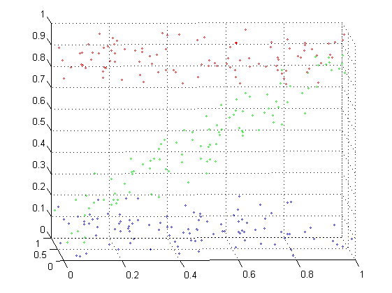
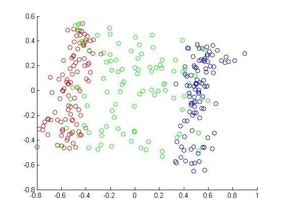
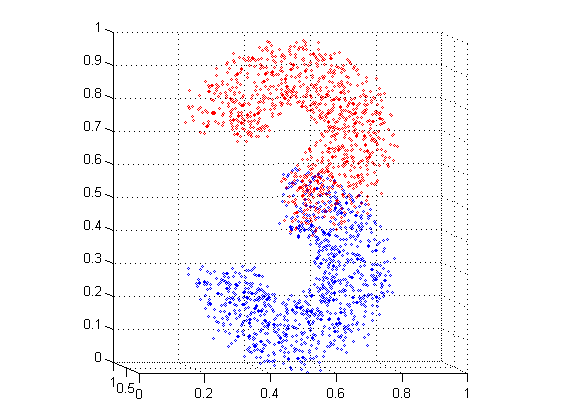
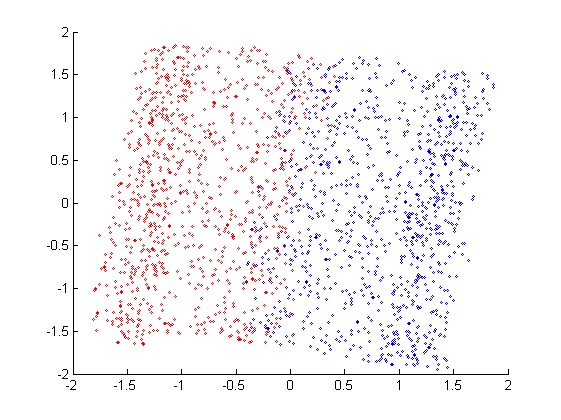

# ISOMAP and LLE to reduce dimension
## Problem Description
考虑如下的问题并实现 ISOMAP，LLE 等降维方法：

1. 在三维空间中产生 “Z” 形状的流形，使用 ISOMAP 方法降维并作图，给出数据的三维分布图和最佳参数下的降维效果图。

2. 在三维空间中产生 “3” 形状的流形，使用 LLE 方法降维并作图，给出数据的三维分布图和最佳参数下的降维效果图。

**注意：数据在产生过程中可不必严格保证形状，大致符合要求即可。不用在数据的产生上花费过多时间。**

## Result
### ISOMAP for 'Z'
#### before

#### after

### LLE for '3'
#### before

#### after

