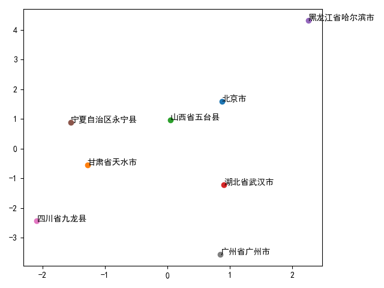
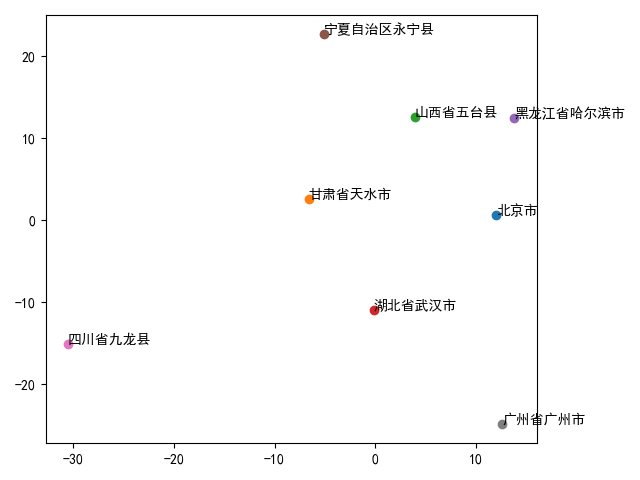

# MDS and city distance
## Problem Description
Please implement MDS algorithm first, and then use your MDS implementation to visualize the distance data for 8 cities (in PPT page 34-35) in 2 dimensional space.

If the distance matrix $\mathbf D$ is not symmetric, you can symmetrize it by $\mathbf D_{\mathrm{sym}}=\frac{1}{2}(\mathbf D+\mathbf D^T)$.

Similar to the first programming assignment, you are **NOT** allowed to use any existing libraries or code snippets that provide MDS algorithm, but using existing libraries to do SVD is allowed.

## Result
### Geometry distance

### Traffic distance
