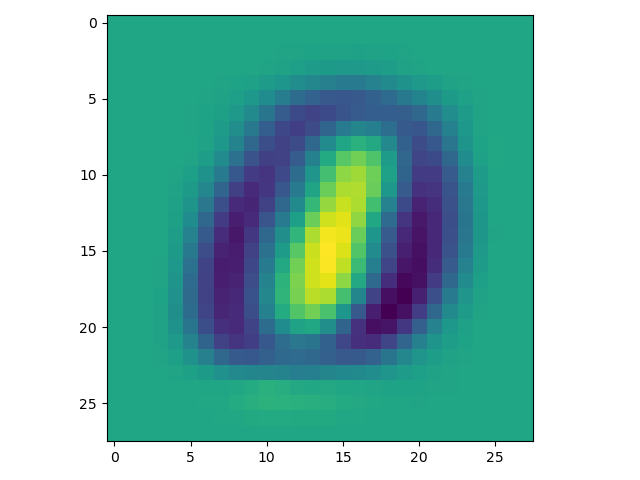

# PCA on MNIST
## Problem Description
For each class in MNIST, please sample 1000 examples, then find the first principal component and visualize it.

In this assignment, you are **NOT** allowed to use any existing libraries or code snippets that provide PCA algorithm, but using existing libraries to do SVD is allowed.

## Result
