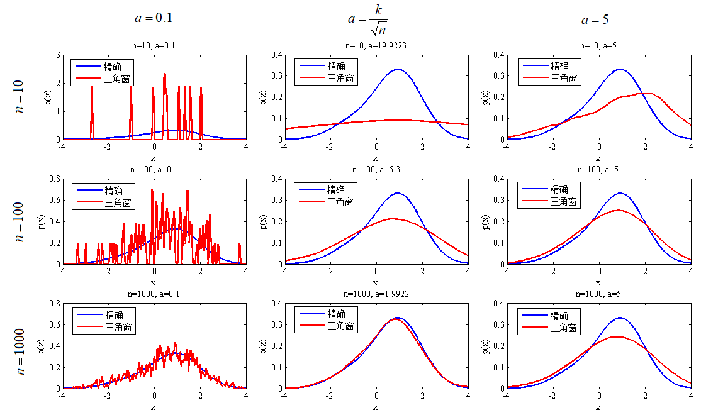
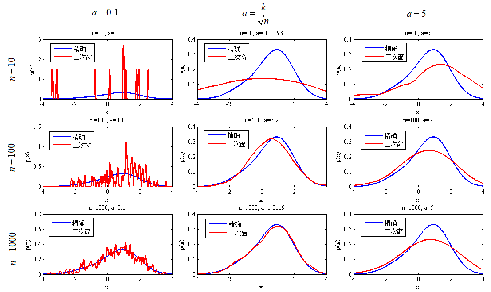
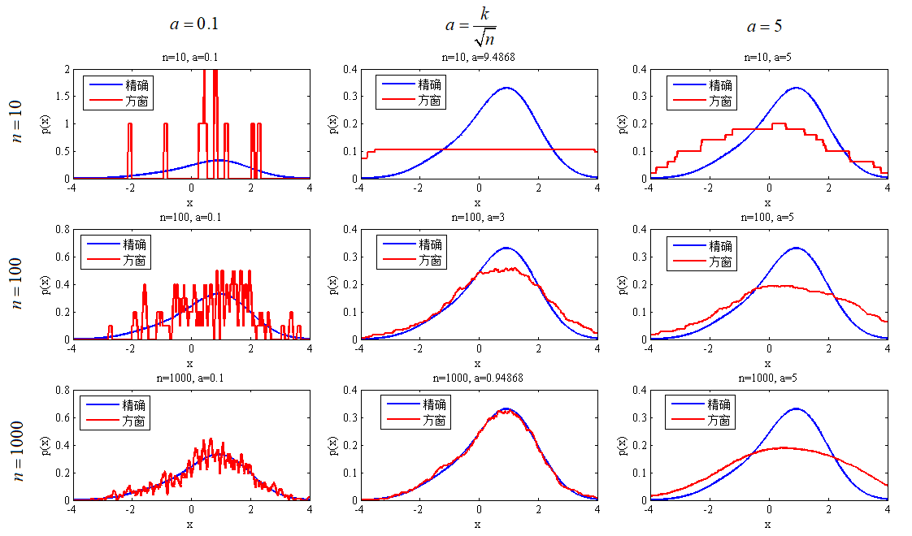
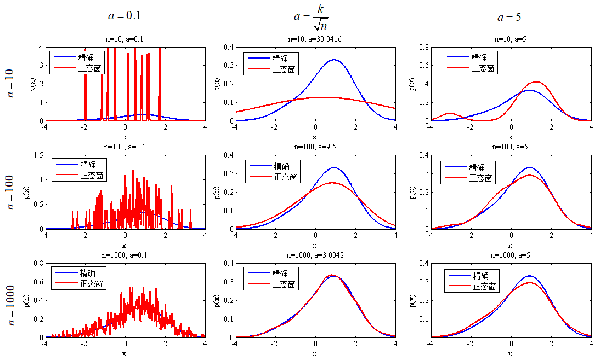

# Function Estimation by Parzen Window method
## Problem Description

Assume  $p(x)\sim0.2\mathcal{N}(-1,1)+0.8\mathcal{N}(1,1)$.  Draw n samples from $p(x)$, for example, $n=5,10,50,100,\cdots,1000,\cdots,10000$. Use Parzen-window method to estimate $p_n(x)\approx p(x)$ (Hint: use randn() function in matlab to draw samples)

(a) Try window-function $P(x)=\left\{
\begin{aligned}
&\frac{1}{a},-\frac{1}{2}a\leq x\leq \frac{1}{2}a \\
&0,otherwise.
\end{aligned}
\right.$. Estimate $p(x)$ with different window width $a$. Please draw $p_n(x)$ under different $n$ and $a$ and $p(x)$ to show the estimation effect.

(b) Derive how to compute $\epsilon(p_n)=\int[p_n(x)-p(x)]^2dx$ numerically.

(c) Demonstrate the expectation and variance of $\epsilon(p_n)$ w.r.t different $n$ and $a$ .

(d) With n given, how to choose optimal $a$ from above the empirical experiences?

(e) Substitute $h(x)$ in (a) with Gaussian window. Repeat (a)-(e).

(g) Try different window functions and parameters as many as you can. Which window function/parameter is the best one? Demonstrate it numerically.

## Results
### Triangle Parzen Window

### Quadrateral Parzen Window

### Square Parzen Window

### Norm Parzen Window
