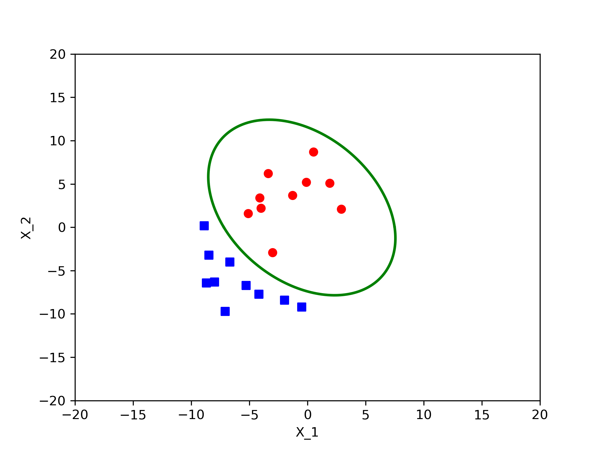

# SVM (Support Vector Machine)
## Problem Description

Category | $x_1$ | $x_2$|
|:---:|:---:|:---:|
$\omega_1$ | -3.0 | -2.9
$\omega_1$ | 0.5 | 8.7
$\omega_1$ | 2.9 | 2.1
$\omega_1$ | -0.1 | 5.2
$\omega_1$ | -4.0 | 2.2
$\omega_1$| -1.3 | 3.7
$\omega_1$ | -3.4 | 6.2
$\omega_1$| -4.1 | 3.4
$\omega_1$ | -5.1 | 1.6
$\omega_1$ | 1.9 | 5.1
$\omega_2$ | -2.0 | -8.4
$\omega_2$ | -8.9 | 0.2
$\omega_2$ | -4.2 | -7.7
$\omega_2$ | -8.5 | -3.2
$\omega_2$ | -6.7 | -4.0
$\omega_2$ | -0.5 | -9.2
$\omega_2$ | -5.3| -6.7
$\omega_2$ | -8.7 | -6.4
$\omega_2$ | -7.1 | -9.7
$\omega_2$ | -8.0 | -6.3

Write a program to implement the SVM algorithm. Train an SVM classifier with data from $\omega_1$ and $\omega_2$ in the following table. Preprocess each training pattern to form a new vector having components $1,x_1,x_2,x_1^2,x_1x_2$ and $ x_2^2$

1. Train you classifier with just the first patterns in the $\omega_1$ and $\omega_2$ and find the separating hyperplane and the margin

2. Repeat 4.1 with the first two points in each category (four points total), the first three point and so on, until the transformed patterns cannot be linearly separated in the transformed space.

you needn't program SVM algorithm by yourself, you can just use some toolkits or  source code such as [libsvm](http://www.csie.ntu.edu.tw/~cjlin/libsvm/) for MATLAB or [scikit-learn](https://scikit-learn.org/stable/modules/svm.html#svm-classification) for python.
You should declare the toolkit you used in your project.

## Result
